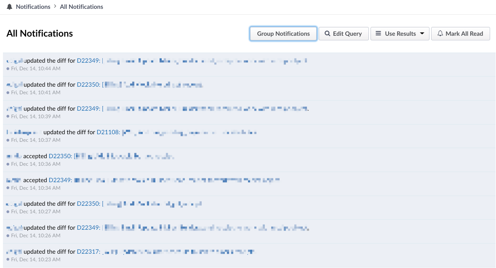
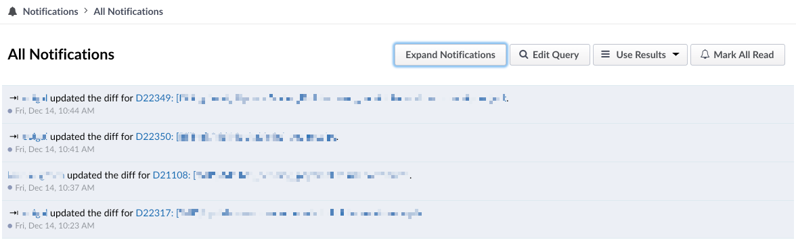

On my team we get a lot of Phabricator notifications and to effectively manage them, I use the Phabricator notifications page. Mostly I just glance at the cause of the notification and have to click through to that Revision to understand what was actually said or changed. Sometimes there’s so many new notifications that it can seem like I have a hundred Revisions to read, making it quite hard to triage the list.

Once I am able to parse the page, however, inevitably most of those notifications end up being just a conversation happening on one or two Revisions, or someone heavily updating a work-in-progress.

Since I have to click through to the Revision anyway, I reasoned, why should I need to see every single notification in that list? What I really need is a list of Revisions that have notifications, not the notifications themselves.

In fact, that’s exactly how GitHub shows its notifications. You generally only see one notification per GitHub issue or PR: the most recent one. I wanted something like this for Phabricator too.

While I’ve long waited and searched for a notification API, it doesn’t look like Phabricator is interested in making one available. Instead they rely on email clients to provide the necessary view filtering. That’s fine, but I was wondering if there was some other way to do it.

I finally realized that a simple solution might be just what I needed and I created a Tampermonkey/Greasemonkey script that can be run by your browser on the notifications page and will group visible notifications by their Revision.

With this script, if you have 80 notifications for three different Revisions, you’ll only see 3 links instead of 80. The script does this only when you toggle the grouping via a “Group Notifications” button added the page, and it remembers your choice for the next time you load it.

The script also adds a checkbox that will allow reloading of the page when a new notification appears (assuming you have push notifications enabled in Phabricator) or when clicking on a notification. This will help keep the list up-to-date.
